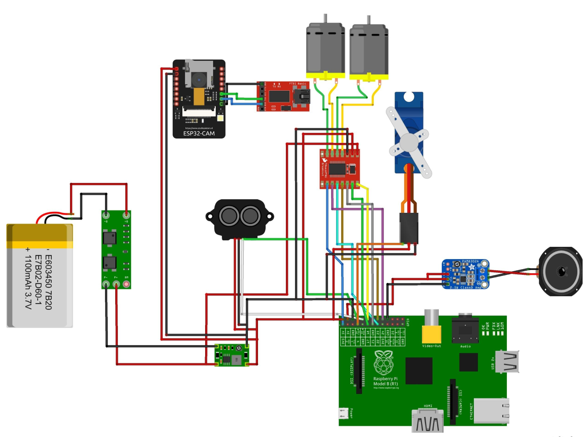

# 2025sp-hexapolo

Zakaria Laribi, Nagyung Kim, Roméo Maignal, Tuan Dang Nguyen

## Table of Contents

- [Project Overview](#project-overview)
- [Features & Operation](#features-and-operation)
- [Hardware Requirements](#hardware-requirements)
- [Software Requirements](#software-requirements)
- [Installation](#installation)
- [Project Structure](#project-structure)
- [License](#license)

## Project Overview

The Hexapolo Bot is a six-legged robot that can find and follow a person by listening to their
voice and looking at them. It starts by saying “Marco” and waits for someone to reply “Polo.”
When it hears the reply, the robot uses four microphones to figure out which direction the sound
came from. Then, it turns to face that direction and checks with its camera if a person is there.
If it sees someone, it walks toward them and stops when it is about one meter away. After that,
the robot will follow the person as they move.

The project’s goal is to combine sound detection, camera vision, and motor control so the robot
can interact with people. The robot will also have optional features, like working in a noisy room
or avoiding obstacles using a lidar scanner. The work is divided into small steps to make sure
each part works well before moving to the next.

### Pictures

| Front View                             | Back View                             |
| -------------------------------------- | ------------------------------------- |
|  |  |

| Below View                       | Inside View                       |
| -------------------------------- | --------------------------------- |
|  |  |

### Videos

https://github.com/user-attachments/assets/a82f1c71-6dc9-49f4-babd-78dbcbe76842

https://github.com/user-attachments/assets/c1124489-3593-4ca6-ac67-65d4f163be2c

### Hardware overview

The Legs and mechanical links to control the legs :

T-bar, gears and motors to rotate heads and control the movement of the legs :


### Electrical Overview

Please note that the following diagram does not include the USB connections between the
FTDI board and the Raspberry Pi as well as that between the microphone array (also not
included) and the Raspberry Pi. Furthermore, note that the speaker amplifier will also be wired
to a 3.5mm headphone jack, which will plug into the microphone array, through its A+ and A-
ports.


## Features and Operation

- **Keyword Detection:** The robot will listen for the word “Polo” and react when it hears it.
- **Sound Direction Estimation:** It will use four microphones and a time difference of arrival
  (TDoA) method to figure out which direction the sound came from.
- **Turning Toward the Sound:** After detecting the direction of the sound, the robot will rotate
  to face that direction.
- **Visual Detection:** The robot will use its camera to check if there is a person in front of it.
- **Walking Toward the Person:** The robot will move toward the person and stop when it is
  about 50 cm away.

The following is an overview of the decision tree outlining Hexapolo's main algorithm :


## Hardware Requirements

### Computer

- **Raspberry Pi 1**

  Note : none of our scripts were tested on any Raspberry Pi other than RPi1. However, because of good backward compatibility, all scripts tested on RPi1 should work on any next iteration of the board. Furthermore, you might encounter a few difficulties linked to the limited computing capabilities of the RP1. Using a more recent iteration of the Raspberry Pi, such as the RPi4, will make the reproducibility process significantly easier.

### Power Source

- **2S 7.4V LiPo battery** (e.g. 2S 7.4V lipo 1100mAh 15C with xt60 connector)
- **DC-DC buck converter** (e.g. WaveShare 6-36V to 5V/3.3V 4A DC-DC buck step down converter)

### Sensors

- **Mic Array** (e.g. ReSpeaker Mic Array v2.0)
- **esp32 Camera** (e.g. AI thinker esp 32-cam)
- **FTDI USB-to-serial** (e.g. FTDI FT232RL USB To TTL Serial Adapter Module)

### Sound Output & Speaker

- **Buzzer** (e.g. Purecrea Piezo buzzer active)
- **Speaker**

For our implementation, we stripped out both the speaker and the amplifier from an unbranded speaker. In the same way, you could use whatever speaker with a jack plug you want. Note that the whole build is quite heavy proportionally to the motors, choose your speaker carefully, the lighter the better. We chose this component to save weight, and you might find this approach useful as well.

### Actuators

- **2x 300rpm 6V n20 motor** (200rpm motors would also work)
- **1.2A DC Motor Driver** (e.g. DFRobot Fermion TB6612FNG 2x1.2A DC Motor Driver)
- **Battery Protection Board** (e.g. 8.4V 2S 20A Lithium Battery Protection BMS Protection Board)

### Mechanical Components

- **10x 8x4x3 Ball Bearing**

### Electrical Interfaces

- **Electrical Switch**
- **USB-A to Micro-USB cable**
- **USB-A to Mini-USB cable**

The combined weight of all the cables and wires might be too heavy for the motors to move effectively with the rest of the build. We suggest that you cut them short and solder the wires inside.

## Software Requirements

### OS

- **Linux** running on your computer. Use whatever distro you prefer, nevertheless you might stumble into less trouble running a debian based distro.
- **Linux (Debian)** running on the RPi1

### Dependencies

Due to the multiple features of our project, the use of computer vision and audio processing, a large, yet lightweight, set of dependencies need to be installed. They are all listed in the following file below :

- [Dependencies List](software/requirements.txt)

Amoung the list of software requirements, you'll find program that are crucial to make this project work.

- **Minicom :** serial communication program used to run program in the Raspberry Pi from remote shell. This solution is heavily used and eliminates the need to connect additional peripherals to the RPi1 for control. [Minicon GitLab repository](https://salsa.debian.org/minicom-team/minicom)

## Installation

```
pip download --no-binary :all: -r .requirements.txt
```

## Project Structure

The repository is organized as follows, important files have been highlighted:

    CAD/
    ├── Electrical Components                                     # 3D files for a few electrical components we use
    │   ├── ...
    │   └── ...
    ├── Electronic plate
    ├── Internal Mechanics                                        # 3D files for each mechanical piece of the gearbox
    │   └── 3D parts
    ├── Moving Parts                                              # 3D files for each piece of the body
    │   └── 3D parts
    └── New head with larger base plate                           # 3D files for each piece of the head
        └── cam_stand
    docs/
    software/
    ├── control                                                   # Basic scripts to control hexapolo
    │   └── __pycache__
    ├── esp                                                       # Scripts handling the communication between the laptop and hexapolo
    ├── laptop                                                    # Scripts processing the video feed from the esp32 cam and communicating with it via Wifi
    ├── machine_learning                                          # Scripts used to train the ML model
    └── pi                                                        # Scripts running on the RPi 1
        ├── model
        │   ├── am
        │   ├── conf
        │   ├── graph
        │   │   └── phones
        │   └── ivector
        └── usb_4_mic_array
            ├── single_frequency_sound_recognizance               # Scripts to recognize a single frequency sound in the case where the voice recognition model couldn't work
            └── test                                              # Unit tests
    README

## License

This project is licensed under the MIT License.

You are free to use, modify, and distribute this software, provided that proper attribution is given to the original authors. For more details, please refer to the LICENSE file included in this repository.
